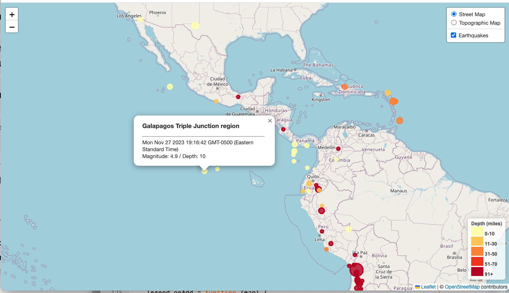

# Leaflet Challenge
Using the Leaflet Javascript Library to Visualize USGS Earthquake Data

## Introduction
The [United States Geological Survey](https://www.usgs.gov/), or USGS for short, is responsible for providing scientific data about natural hazards, the health of our ecosystems and environment, and the impacts of climate and land-use change. They collect a massive amount of data from all over the world each day, including earthquake data. In this project, the [Leaflet Javascript library](https://leafletjs.com/) is employed to create a simple web-based visualization tool for [realtime earthquake data](https://earthquake.usgs.gov/earthquakes/feed/v1.0/geojson.php) for the past 30 days of magnitude 4.5 and above. The tool can be view at this link.

 

